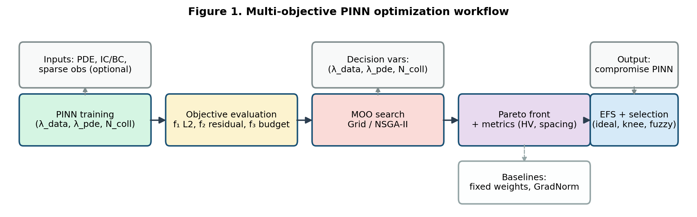

# pinn-moo-efs

**Multi-Objective Optimization of PINNs Using Evolutionary Fuzzy Systems**

Research codebase for exploring trade-offs among **accuracy**, **physics consistency**, and **data efficiency** when training Physics-Informed Neural Networks (PINNs). An outer multi-objective optimizer (grid search / NSGA-II / NSGA-III) maps Pareto fronts over loss weights and collocation budget; an **Evolutionary Fuzzy System (EFS)** selects interpretable compromise solutions.

**Author:** Hamza Haseeb · **Affiliation:** Near East University

---

## Overview

| Objective | Symbol | Description |
|-----------|--------|-------------|
| Accuracy | f₁ | Relative L2 error vs. reference solution |
| Physics consistency | f₂ | Mean PDE residual |
| Data efficiency | f₃ | Collocation + sparse observation count |

**Benchmarks:** 1D Poisson (`src/pde_poisson.py`) · 1D viscous Burgers (`src/pde_burgers.py`)

<p align="center">
  
  <br><em>Multi-objective PINN optimization workflow</em>
</p>

---

## Quick start

```bash
git clone https://github.com/Haseebcodejourney/pinn-moo-efs.git
cd pinn-moo-efs
pip install -r requirements.txt
```

### Run experiments

```bash
# Baseline PINN
python run_experiment.py --mode baseline --pde burgers --seed 42

# Grid search (MOO)
python run_experiment.py --mode grid --pde poisson --epochs 2500 --seed 42

# NSGA-II
python run_experiment.py --mode nsga2 --pde burgers --pop-size 10 --generations 6

# NSGA-III
python run_experiment.py --mode nsga3 --pde burgers

# Evolve fuzzy rules (after MOO)
python run_experiment.py --mode efs --pde burgers

# Generate figures + summary_table.csv
python run_experiment.py --mode plot --pde burgers

# Full pipeline (reduced quick test)
python run_experiment.py --mode matrix --quick --seed 42

# Or run everything end-to-end
python finish_all.py
```

### Sparse noisy observations (Burgers)

```bash
python run_experiment.py --mode grid --pde burgers --n-obs 20 --noise 0.05 --epochs 2500 --seed 42
```

---

## CLI modes

| Mode | Description |
|------|-------------|
| `baseline` | Fixed-weight PINN (`--balancer gradnorm` or `relobralo` optional) |
| `grid` | Grid over (λ_data, λ_pde, N_coll) |
| `nsga2` | NSGA-II hyperparameter search |
| `nsga3` | NSGA-III with Das–Dennis reference directions |
| `efs` | GA evolves fuzzy membership parameters + rule weights |
| `plot` | Pareto figures, EFS comparison, `summary_table.csv` |
| `matrix` | Burgers obs/noise sweep + Poisson cross-PDE |

---

## Project structure

```
pinn-moo-efs/
├── run_experiment.py      # Main CLI
├── finish_all.py          # End-to-end experiment pipeline
├── requirements.txt
├── src/
│   ├── pde_registry.py    # PDE abstraction
│   ├── pde_burgers.py     # 1D Burgers + sparse obs
│   ├── pde_poisson.py     # 1D Poisson
│   ├── pinn.py            # MLP architecture
│   ├── train.py           # PINN training loop
│   ├── objectives.py      # f₁, f₂, f₃
│   ├── nsga2_optimizer.py
│   ├── fuzzy_rules.py
│   ├── efs_optimizer.py
│   ├── selection_methods.py
│   ├── pareto_metrics.py
│   ├── plot_results.py
│   └── plot_workflow.py
├── experiments/configs/
├── results/               # CSV logs + figures (included)
└── paper/                 # Draft manuscript + references.bib
```

---

## Key results (seed = 42)

| Benchmark | Best L2 | Best residual | Pareto points |
|-----------|---------|---------------|---------------|
| Poisson (knee) | 1.01×10⁻⁴ | 3.23×10⁻³ | 5 |
| Burgers (NSGA-II) | 0.233 | 5.15×10⁻³ | 6 |
| Burgers + 20 obs, σ=0.05 | 0.246 | 1.91×10⁻² | 4 |

See `results/summary_table.csv` and `results/figures/` for full outputs.

---

## Selection methods compared

- Fixed-weight PINN  
- Grid search / NSGA-II / NSGA-III Pareto fronts  
- Ideal-point & knee-point selection  
- Static fuzzy (Mamdani rules)  
- **Evolved fuzzy (EFS)** — GA over 18 rule/MF parameters  

---

## Requirements

- Python 3.10+
- PyTorch, pymoo, scipy, pandas, matplotlib

---

## Citation

If you use this code, please cite:

```bibtex
@misc{haseeb2026pinnmoiefs,
  author       = {Haseeb, Hamza},
  title        = {Multi-Objective Optimization of PINNs Using Evolutionary Fuzzy Systems},
  year         = {2026},
  publisher    = {GitHub},
  howpublished = {\url{https://github.com/Haseebcodejourney/pinn-moo-efs}}
}
```

---

## License

MIT License — see repository for details.

## Paper

Draft manuscript: `paper/LMNotes_full_paper.md` · References: `paper/references.bib`
